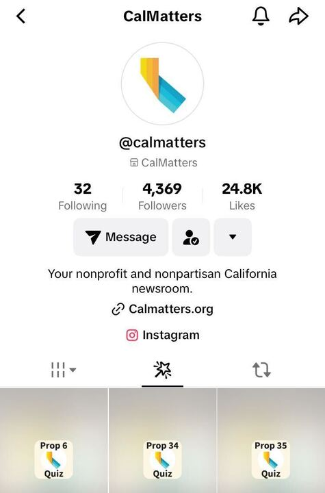

# tiktok-effects-props-2024

TikTok quiz filter adaption of the [2024 Voter Guide prop quizzes](https://calmatters.org/california-voter-guide-2024/propositions/) as augmented reality effects, commonly referred to as "filters." Users tilt their heads to answer yes/no/unsure to 1-4 questions to determine their stance on the ballot propositions.

CalMatters published a demo on [how to use the Prop. 33 quiz on Tiktok](https://www.tiktok.com/@calmatters/video/7429809720568925483).

The quizzes are accessible under the :magic_wand: effects tab on the [CalMatters TikTok profile page](https://www.tiktok.com/@calmatters) (only viewable on the TikTok mobile apps):



The web version of the quizzes are available at [voter guide webpage](https://calmatters.org/california-voter-guide-2024/propositions/) for each respective proposition.

# Development

The quiz effect is developed as a template project using the `./effect-template` project files. Any changes to the core functionality should be made to the template project.

The specific quiz effect for each proposition is generated by the `./generate_prop_quizzes.py` script. This script duplicates the `./effect-template/` template directory and sets the number of questions with the corresponding values for each question's options. The generated project directories use blank questions and result card assets, which can be replaced manually or by running the `./set_assets.py` script.

For example, if I needed to adjust the position of a specific [Scene Object](https://effecthouse.tiktok.com/learn/guides/technical-guides/objects/scene/scene-object):

1. Launch `./effect-template/effect.ehproj` in Effect House
2. Adjust the relevant object's Position coordinates
3. Save changes to project and close Effect House
4. Delete any existing prop effect project directories, except for [Proposition 34](prop34/) (see note below)
5. Run the `./generate_prop_quizzes.py` script to regenerate the prop quizzes
6. Run the `./set_assets.py` script to replace the blank assets the corresponding prop's assets
7. If publishing the effects or an update, then open each project and follow [deploy instructions](#deployment)

This workflow allows for rapid development without manually editing each effect individually. 

Note: Prop. 34 is an exception due to its longer intro card sequence. Changes to this effect should be made to the individual project to avoid needing to rebuild the intro sequence for every change to the base template. 

## Dependencies

- Python 3.11.7
    - Custom scripts to generate the TikTok effects from the base template and set assets
- Effect House 4.6.2
    - [Effect House](https://effecthouse.tiktok.com/download) is TikTok's effect development platform
    - Quiz effects were built and published using 4.6.2 and future versions may deprecate required features. ([Download previous Effect House versions](https://effecthouse.tiktok.com/download/previous-versions/))


## Project Structure

```
tiktok-effects-props-2024/
├── effect-template/           # Base template project for all effects
│   └── effect.ehproj         # Effect House project file
├── assets/                    # Asset files for all effects
│   ├── prop2/                # Assets for Proposition 2
│   ├── prop3/                # Assets for Proposition 3
│   └── ...                   # Assets for other propositions
├── prop2/                     # Generated effect project for Prop 2
├── prop3/                     # Generated effect project for Prop 3
├── prop34/                    # Special case: Custom effect for Prop 34
├── icons/                     # Effect icons for TikTok
├── generate_prop_quizzes.py   # Script to generate prop quiz effects
├── set_assets.py             # Script to update effect assets
├── set_icons.py              # Script to update effect icons
├── get_assets.py             # Script to retrieve effect assets
├── README.md                 # Project documentation
├── LICENSE                   # Project license
└── .gitignore               # Git ignore rules
```

### Key Directories and Files

- **`effect-template/`**: Contains the base Effect House project that serves as a template for all prop quiz effects. Any changes to core functionality should be made here.
- **`assets/`**: Stores all visual assets (images, cards, etc.) for each proposition. Each prop has its own subdirectory.
- **`propNUMBER/`**: Generated effect projects for each proposition. These are created by `generate_prop_quizzes.py` and contain the actual Effect House projects.
- **`prop34/`**: Special case directory for Proposition 34, which has a custom intro sequence and requires manual modifications.
- **`icons/`**: Contains the TikTok effect icons for each proposition.
- **Scripts**:
  - `generate_prop_quizzes.py`: Creates new effect projects from the template
  - `set_assets.py`: Updates assets in effect projects
  - `set_icons.py`: Updates effect icons
  - `get_assets.py`: Retrieves assets from effect projects

# Deployment

TikTok moderates each submitted effect submitted for content and performance. It takes anywhere from two hours to three days to go live following submission. Submissions are made in Effect House, so each effect needs to be opened individually for submission.

1. Open the effect in Effect House
2. Select the `Submit` button
3. If the `What would you like to do?` menu appears, then select the appropriate option
4. Enter the [effect details](#effect-details)
5. Select `Next`
6. Review the details and submit for approval

## Effect details
| Field                                              | Value                                                                                                            |
| -------------------------------------------------- | ---------------------------------------------------------------------------------------------------------------- |
| Effect name (25 characters total)                  | Prop X by CalMatters                                                                                             |
| Default sound (optional)                           | None                                                                                                             |
| Hint (optional)                                    | Tilt head                                                                                                        |
| Category (optional)                                | Interactive                                                                                                      |
| Tags (optional, up to 5, each tag has 30-char max) | California ballot propositions, California general election, California politics, 2024 election, Voter education |
| Demo video (optional)                              | Not submitting demo                                                                                              |

# Credits

[Full credits for the CalMatters 2024 Voter Guide](https://calmatters.org/california-voter-guide-2024/#h-credits)

[CalMatters](https://calmatters.org/) is a nonpartisan and nonprofit news organization bringing Californians stories that probe, explain and explore solutions to quality of life issues while holding our leaders accountable. [Learn more about CalMatters](https://calmatters.org/about/)
